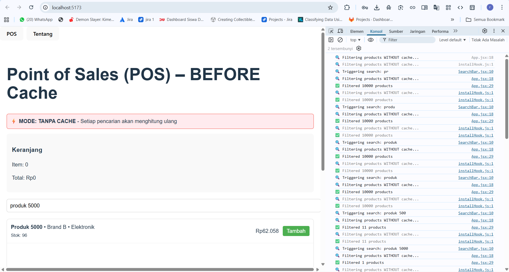
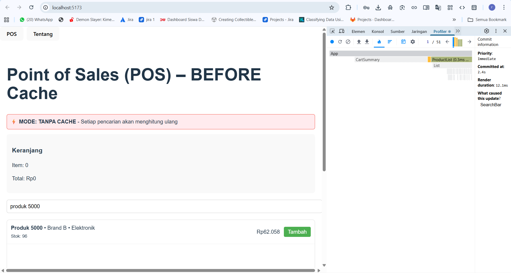
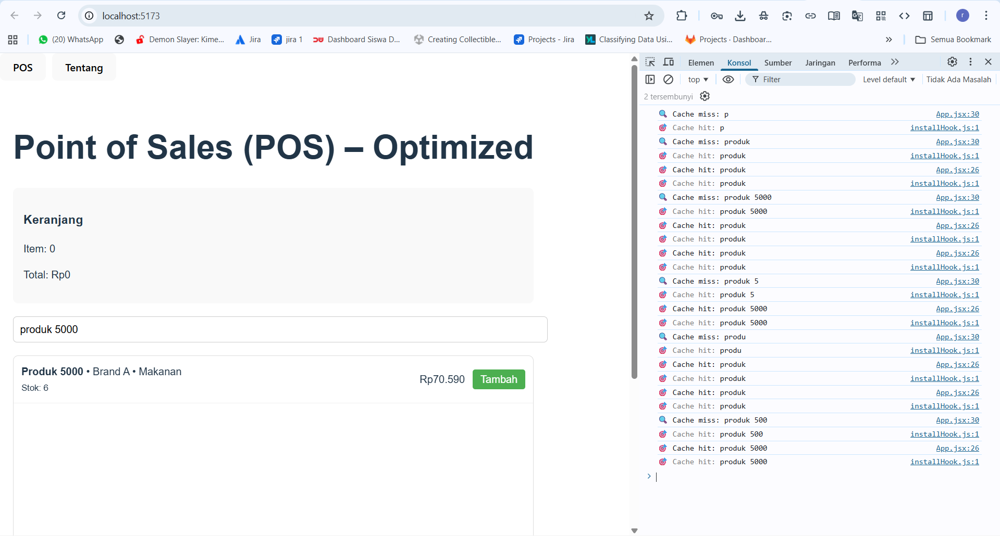

# Optimasi Performa React dengan Caching

**Nama:** Rosyid Stania Ardiyan Putra 
**NIM:** V3424075  
**Kelas:** TIC 24  
**Mata Kuliah:** Pemrograman Front-End

---

## 🎯 Tujuan
Menganalisis perbedaan performa aplikasi Point of Sales (POS) antara implementasi **tanpa cache** dan **dengan cache**, serta memahami dampak caching terhadap pengalaman pengguna.

---

## 📋 Metodologi
- Aplikasi digunakan: **Point of Sales** dengan **10.000 data produk**
- Pengujian dilakukan dengan melakukan pencarian `"produk 5000"` secara berulang
- Tools analisis:
  - React DevTools Profiler
  - Browser Console
- Metrik performa:
  - Waktu render
  - Konsistensi respons
  - Beban komputasi

---

## 🔴 Versi Tanpa Cache

**Karakteristik:**
- Setiap pencarian menghitung ulang dari awal
- Tidak ada penyimpanan hasil sebelumnya
- Beban komputasi konsisten tinggi

### 📸 Screenshot Profiling (Tanpa Cache)
Console Log:


Profiling (React Profiler):


**Performa:**
| Pengujian | Waktu Render |
|----------|-------------|
| Pencarian Pertama | 1.0ms |
| Pencarian Berulang | 1.0ms |

---

## 🟢 Versi Dengan Cache

**Karakteristik:**
- Hasil pencarian disimpan ke cache memory
- Pencarian berulang menjadi instan
- Beban CPU turun signifikan

### 📸 Screenshot Profiling (Dengan Cache)
Console Log:


Profiling (React Profiler):


**Performa:**
| Pengujian | Waktu Render |
|----------|-------------|
| Pencarian Pertama (Cache MISS) | 1.0ms |
| Pencarian Berulang (Cache HIT) | 0.4ms |

**Improvement:** **60% lebih cepat**

---

## 💻 Implementasi Cache

```javascript
// Cache mechanism
const searchCache = new Map();
const MAX_CACHE_SIZE = 50;

export const getFromCache = (key) => {
  return searchCache.get(key);
};

export const setToCache = (key, data) => {
  if (searchCache.size >= MAX_CACHE_SIZE) {
    const firstKey = searchCache.keys().next().value;
    searchCache.delete(firstKey);
  }
  searchCache.set(key, data);
};
